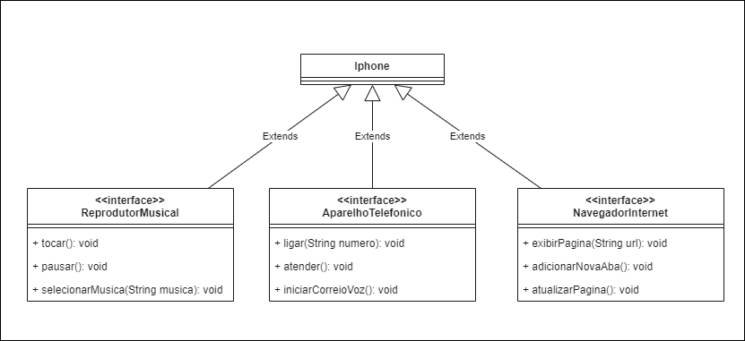

# Modelando o iphone

## Sobre
Este repositório apresenta uma forma simples de representar o iphone no computador. Este repositório modela um diagrama de classes que mostrando as classes e interfaces para implementar de forma mínima o iphone.

## Funcionalidades
1. Reprodutor Musical
    - Métodos: 
        ```tocar()```, ```pausar()```, ```selecionarMusica(String musica)```
2. Aparelho Telefônico
    - Métodos
        ```ligar(String numero)```, ```atender()```, ```iniciarCorreioDeVoz()```
3. Navegador na Internet
    - Métodos
        ```exibirPagina(String url), adicionarNovaAba(), atualizarPagina()```

## Objetivos
    1. Criar um diagrama UML para representar as funcionalidades do iphone.
    2. Implementar as classes e interfaces correspondentes em Java.

## Diagrama UML



## Tecnologias
- Java